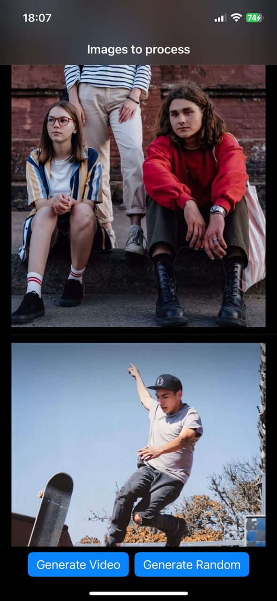
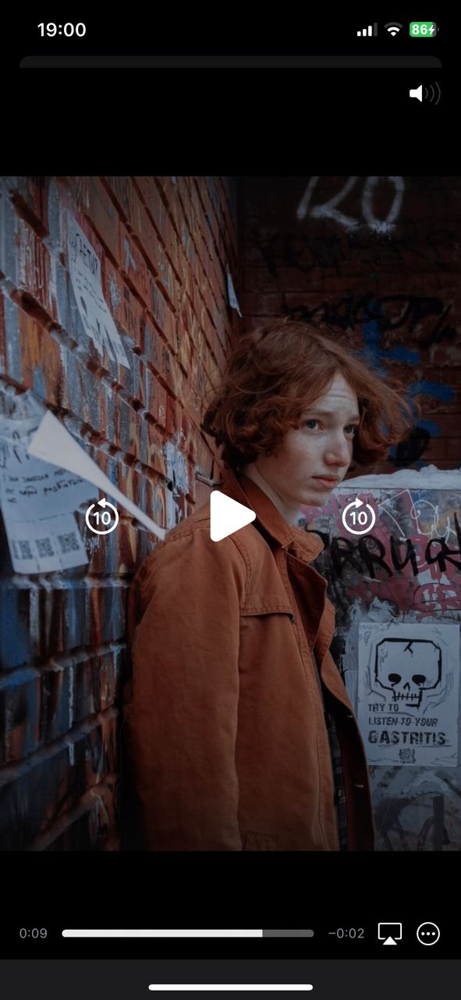

# MLVideoGen
This is my test project that creates cool animations by generating videos from images using CoreML.

## Screenshots

Here are some screenshots of the project:

## App Flow
App allows you to create two different types of videos using a set of images.

The first video type is a normal sequence of images without any background effects. To generate this type of video, simply click the 'Generate Video' button and the app will create a video with the images in their original order.

The second video type is a randomized sequence of images with some added background effects. To create this type of video, click the 'Generate Random' button and the app will randomly shuffle the order of the images and apply some background effects to create a unique and eye-catching video.

## Example Results

